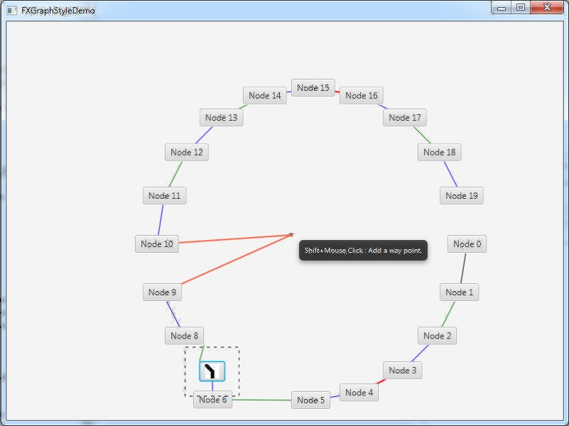

# javafxgraph
Automatically exported from code.google.com/p/javafxgraph

The JavaFX Graph is a small GUI panel to embed it into a JavaFX application. It displays connected "Nodes" and "Edges". 
You can move the elements within the panel. You are able to set different css-styles.

I will use this component for block diagrams in a desktop application.

